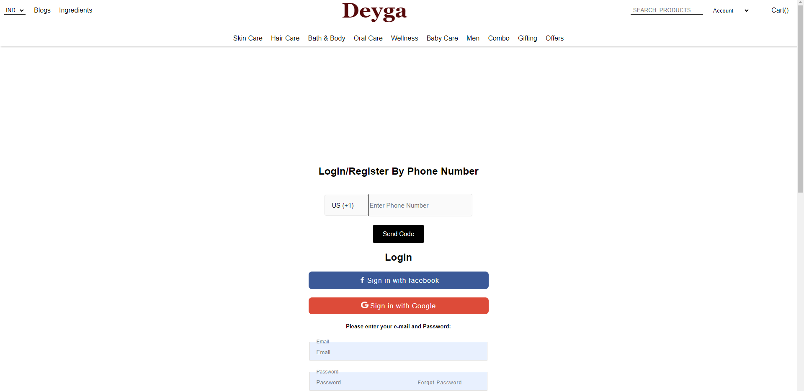

<h1 align="center"> Dayga-clone</h1>

This is a Indian Natural Cosmetics & Beauty products selling website.

Things uses in building this project…
HTML (HyperText Markup Language)
CSS (Cascading Style Sheets)
Jscript(Java Script)
getcssscan (a website to get many styles);
local Storage (to store and transfer the required data from one page to another)

<h2>Homepage<h2>

<h2>Homepage<h2>

<h2>Homepage<h2>

<h2>Homepage<h2>

<h2>Homepage<h2>

